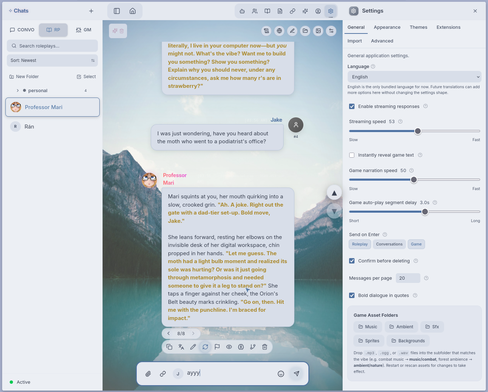
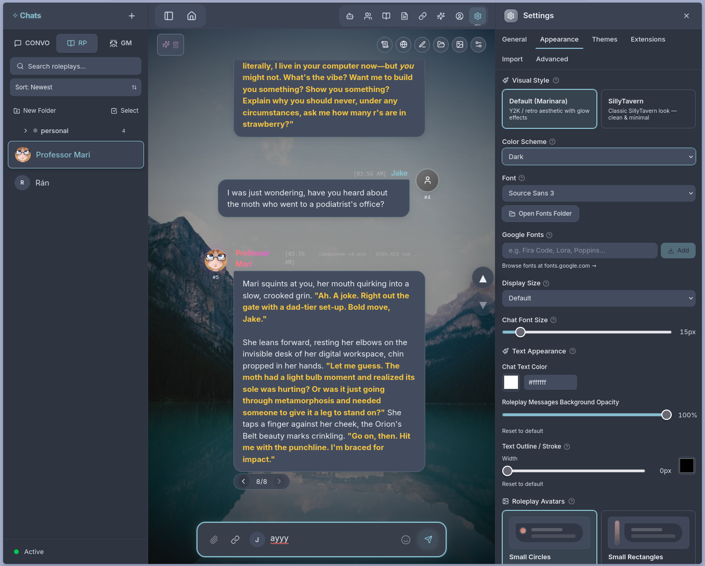

# Nord

A comprehensive Nord Dark theme for [Marinara Engine](https://github.com/Pasta-Devs/Marinara-Engine), based on the [Nord color palette](https://www.nordtheme.com/).

Supports both dark and light modes, with full coverage of chat, RP, and GM mode UI elements. Best used with the Theme Helper extension for complete theming of hardcoded engine elements.

## Info
- **Author:** jake9000
- **License:** CC-0, no rights reserved
- **Targeting:** Marinara Engine v1.5.6

## Screenshots

