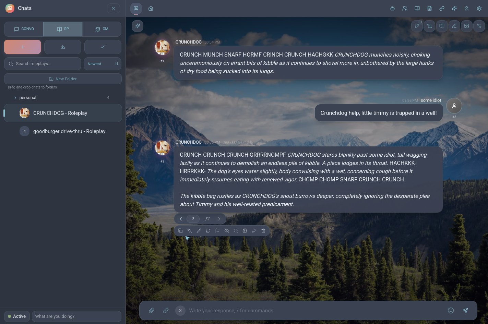
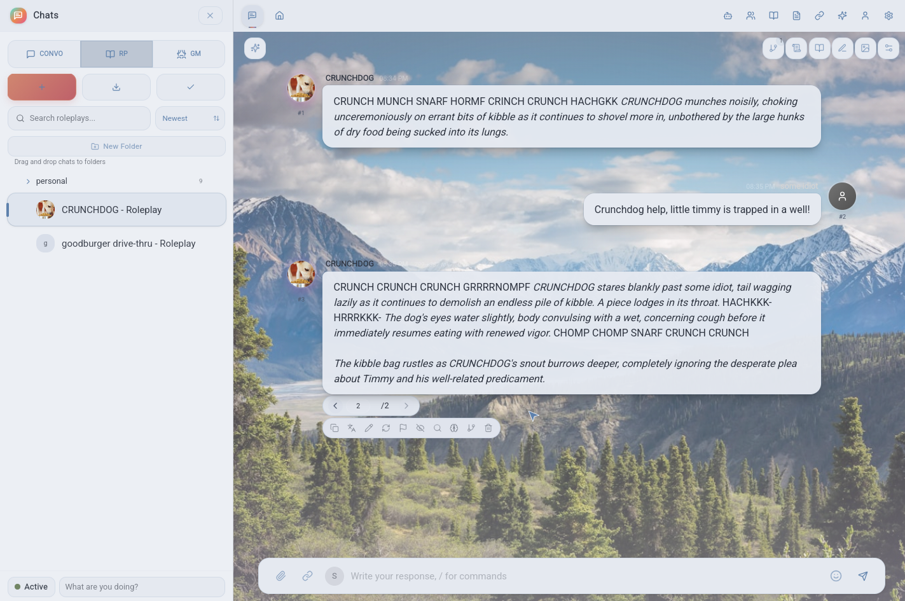

# Nord

A comprehensive Nord Dark theme for [Marinara Engine](https://github.com/Pasta-Devs/Marinara-Engine), based on the [Nord color palette](https://www.nordtheme.com/).

Supports both dark and light modes, with full coverage of chat, RP, and GM mode UI elements. Best used with the Theme Helper extension for complete theming of hardcoded engine elements.

## Screenshots

## Instructions

1. Download [nord.json](https://github.com/jake9000/me-nord/blob/master/nord.json), and upload it to marinara-engine in Settings > Addons
2. Good Job

To change between light and dark, use the dropdown menu at Settings > Appearance > Color Scheme.

## Troubleshooting

* message action buttons may be un-themed after changing color scheme. Refresh the page. 
* If ME appears to be haunted, even when changing to the default theme, double check that you put the theme in the theme area and the extension in the extension area, and that you only have one instance of each. 
* For ppl hosting this as a server: You only need to upload the theme once, but extensions must be uploaded in every web browser that you access ME from. 

## Info
- **Author:** jake9000
- **License:** CC-0, no rights reserved
- **Targeting:** Marinara Engine v1.5.6

